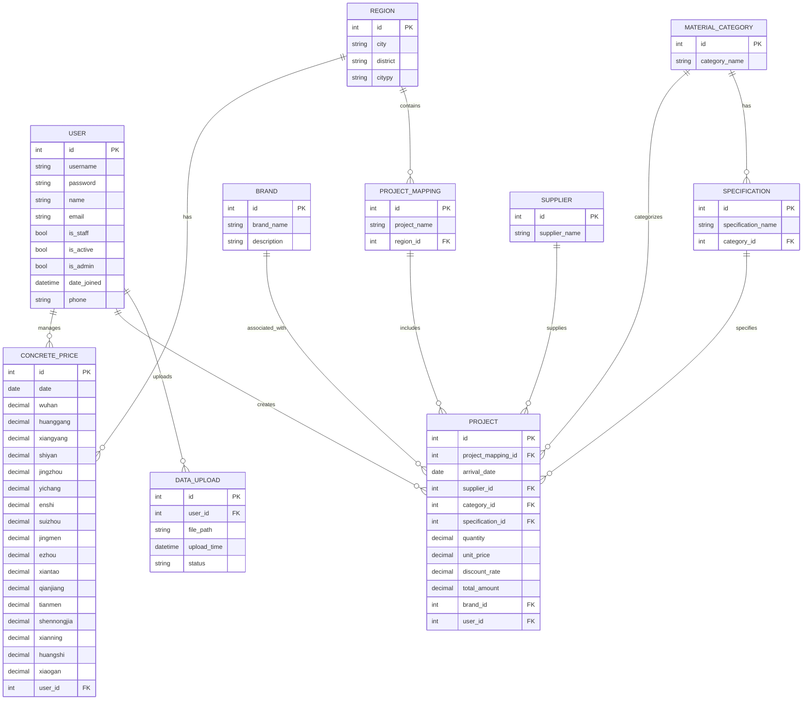
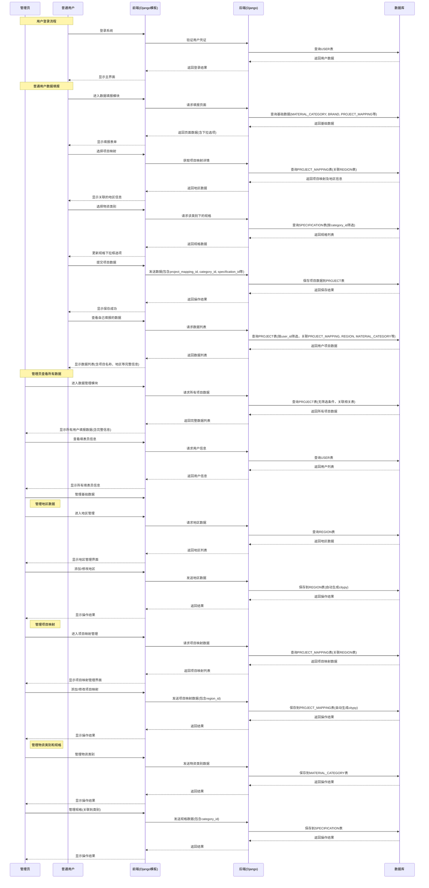

### 更新后的项目文档

#### 项目概述
本项目旨在构建一个数据可视化平台，支持用户进行数据处理、展示和分析。项目采用Django全栈开发架构，前端使用Django模板系统和原生JavaScript，后端使用Django，数据库采用MySQL，数据可视化使用ECharts。

#### 模块结构与功能

1. **首页模块**
   - 功能：展示项目概览、最新数据动态、快捷入口
   - 实现思路：使用Django模板系统设计响应式布局，集成数据概览卡片和导航链接

2. **关于模块**
   - 功能：介绍项目背景、团队信息、技术栈
   - 实现思路：静态页面展示，包含项目介绍和团队成员信息

3. **帮助模块**
   - 功能：提供用户操作指南、FAQ、联系支持
   - 实现思路：文档型页面，集成搜索功能和常见问题解答

4. **数据填报模块**
   - 功能：支持用户上传和录入数据
   - 实现思路：Django表单设计，支持文件上传和手动录入，数据校验

5. **数据展示模块**
   - 功能：以表格形式展示原始数据
   - 实现思路：数据分页展示，支持筛选和排序功能
   - 权限控制：
     - 普通用户：仅查看自己填报的数据
     - 管理员：查看所有用户填报的数据

6. **数据处理模块**
   - 功能：数据清洗、转换、计算
   - 实现思路：基于Python的数据处理脚本，集成到Django后端

7. **数据可视化模块**
   - 功能：图表展示数据分析结果
   - 实现思路：使用ECharts创建交互式图表，支持多种图表类型
   - 特殊要求：
     - 支持单月和多月数据展示
     - 单月：柱状图+折线图组合（项目单价柱状图+信息价折线图）
     - 多月：多条折线图（各项目单价和信息价线）
     - 地区多选筛选功能
     - 时间范围选择（开始年月到结束年月）
     - 统一信息价线颜色

8. **数据预测模块**
   - 功能：基于历史数据进行趋势预测
   - 实现思路：集成机器学习算法，提供预测接口

9. **用户中心模块**
   - 功能：用户个人信息管理、权限控制
   - 实现思路：用户认证系统，角色权限管理

#### 数据库设计

#### 角色功能时序图

#### 技术栈

- 前端：Django模板系统 + 原生JavaScript + ECharts
- 后端：Django + Python
- 数据库：MySQL
- 数据处理：Python pandas/numpy
- 部署：Docker容器化部署

#### 开发计划

1. **第一阶段：核心功能开发（预计6周）**
   - 环境搭建与技术选型确认（1周）
     - 搭建Django开发环境
     - 配置MySQL数据库
     - 集成ECharts可视化库
   - 数据库设计与实现（1周）
     - 创建数据库表结构
     - 实现表间关系约束
     - 初始化基础数据（地区、物资类别等）
   - 用户认证与权限系统（1周）
     - 实现用户注册、登录功能
     - 实现Django内置认证机制
     - 实现基础权限控制（普通用户/管理员）
   - 数据填报模块开发（1周）
     - 实现数据录入表单（Django Forms）
     - 开发数据校验逻辑
     - 实现文件上传功能
   - 数据处理模块开发（1周）
     - 实现数据清洗功能
     - 开发数据转换逻辑
     - 实现数据计算功能
   - 数据可视化核心功能（1周）
     - 实现单月数据图表展示（柱状图+折线图组合）
     - 实现多月数据图表展示（多条折线图）
     - 实现地区筛选功能

2. **第二阶段：功能完善与优化（预计5周）**
   - 数据展示模块开发（1周）
     - 实现数据表格展示功能
     - 添加数据筛选和排序功能
     - 实现分页显示
   - 可视化功能增强（1周）
     - 实现时间范围选择功能
     - 实现信息价线颜色统一
     - 添加图表交互功能
   - 用户中心模块完善（1周）
     - 实现用户个人信息管理
     - 完善权限管理界面
     - 实现密码修改功能
   - 管理员功能开发（1周）
     - 实现信息价管理功能
     - 实现品牌数据管理功能
     - 实现物资类别管理功能
   - 系统优化（1周）
     - 数据库查询优化
     - 页面加载性能优化
     - 用户体验优化

3. **第三阶段：高级功能集成（预计4周）**
   - 数据预测模块开发（2周）
     - 集成机器学习算法库
     - 实现数据趋势预测功能
     - 开发预测结果可视化展示
   - 系统监控与日志（1周）
     - 实现操作日志记录
     - 添加系统监控功能
     - 实现数据备份机制
   - 系统集成测试（1周）
     - 进行端到端测试
     - 修复集成问题
     - 性能调优

4. **第四阶段：测试与部署（预计3周）**
   - 系统测试（1周）
     - 单元测试
     - 集成测试
     - 用户验收测试
   - 系统优化（1周）
     - 根据测试反馈进行功能优化
     - 修复发现的bug
     - 优化用户体验
   - 部署与文档完善（1周）
     - 系统部署到生产环境
     - 完善用户文档和开发文档
     - 制作用户培训材料

#### 数据库表结构详细说明

根据项目需求和补充信息，数据库表结构如下：

1. **用户表 (USER)**
   - 记录系统用户信息
   - 包含权限字段区分普通用户和管理员
   - 字段：id, name, password, phone, email, permission

2. **混凝土信息价表 (CONCRETE_PRICE)**
   - 记录各地区混凝土信息价
   - 包含湖北省主要地级市数据
   - `user_id`字段记录管理员ID，用于追踪修改记录
   - 字段：id, date, wuhan, huanggang, xiangyang, shiyan, jingzhou, yichang, enshi, suizhou, jingmen, ezhou, xiantao, qianjiang, tianmen, shennongjia, user_id

3. **地区表 (REGION)**
   - 记录省市县区域信息
   - 用于项目与地区关联
   - 字段：id, city, district

4. **项目映射表 (PROJECT_MAPPING)**
   - 建立项目与地区的映射关系
   - 字段：id, project_name, city, district

5. **物资类别表 (MATERIAL_CATEGORY)**
   - 记录不同的物资类别
   - 用于分类管理物资
   - 字段：id, category_name

6. **品牌表 (BRAND)**
   - 记录不同物资类别下的品牌信息
   - `category_id`外键关联到`MATERIAL_CATEGORY`
   - 管理员可维护品牌数据
   - 字段：id, brand_name, category_id

7. **项目表 (PROJECT)**
   - 核心业务数据表，包含详细项目信息：
     - `project_name`: 项目名称
     - `arrival_date`: 到货日期
     - `supplier`: 供应商
     - `category_id`: 物资类别ID（外键关联MATERIAL_CATEGORY）
     - `specification`: 规格
     - `quantity`: 数量
     - `unit_price`: 单价
     - `total_amount`: 合计
     - `brand_id`: 品牌ID（外键关联BRAND）
     - `user_id`: 填表用户ID（外键关联USER表）
   - 字段：id, project_name, arrival_date, supplier, category_id, specification, quantity, unit_price, total_amount, brand_id, user_id

8. **数据上传记录表 (DATA_UPLOAD)**
   - 记录用户上传文件的历史
   - 字段：id, user_id, file_path, upload_time, status

#### 权限管理说明

- **普通用户**：
  - 可查看和填报项目数据
  - 可对自己填报的数据进行增删改查操作
  - 可进行数据可视化操作
  - 可查看信息价数据，但不能修改
  - 仅能查看自己填报的数据，无法查看其他用户数据

- **管理员**：
  - 拥有普通用户所有权限
  - 可修改各地区信息价数据
  - 可新增、修改、删除品牌数据
  - 可管理物资类别
  - 可查看系统操作日志
  - 可查看所有用户填报的数据及填表员信息
  - 可对所有数据进行管理操作

#### 数据访问控制实现思路

1. 在Django视图层面实现数据访问控制：
   - 普通用户请求数据时，自动添加`user_id`筛选条件
   - 管理员请求数据时，不限制数据访问范围

2. 在模板层面实现权限控制：
   - 根据用户权限显示不同的操作按钮和菜单项
   - 普通用户仅显示与自己数据相关的操作
   - 管理员显示完整的数据管理功能

3. 使用Django内置权限系统：
   - 利用Django的用户组和权限机制
   - 为不同角色分配相应权限
   - 在视图中检查用户权限

这种设计能够满足当前数据处理和可视化需求，同时为未来扩展预留了空间。通过`user_id`字段可以追踪数据来源，通过地区关联可以实现按区域筛选数据，通过品牌和物资类别关联可以实现更精细的数据管理，权限控制确保了数据安全和隐私。