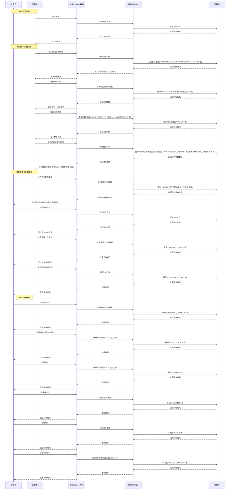

### 项目文档

#### 项目概述
本项目旨在构建一个数据可视化平台，支持用户进行数据处理、展示和分析。项目采用Django全栈开发架构，前端使用Django模板系统和原生JavaScript，后端使用Django，数据库采用MySQL，数据可视化使用charts.js。

### 模块结构与功能

1. **首页模块**
   - 功能：展示项目概览、最新数据动态、快捷入口
   - 实现思路：使用Django模板系统设计响应式布局，集成数据概览卡片和导航链接
   - 访问路径：``

2. **关于模块**
   - 功能：介绍项目背景、团队信息、技术栈
   - 实现思路：静态页面展示，包含项目介绍和团队成员信息
   - 访问路径：``

3. **帮助模块**
   - 功能：提供用户操作指南、FAQ、联系支持
   - 实现思路：文档型页面，集成搜索功能和常见问题解答
   - 访问路径：``

4. **仪表盘模块**
   - 功能：提供数据汇总视图和关键指标展示
   - 实现思路：通过图表和统计数据展示项目整体情况
   - 访问路径：``

5. **数据填报模块**
   - 功能：支持用户上传和录入数据
   - 实现思路：Django表单设计，支持文件上传和手动录入，数据校验
   - 访问路径：
     - 添加项目数据：``
     - 项目数据列表：``

6. **数据展示模块**
   - 功能：以表格形式展示原始数据
   - 实现思路：数据分页展示，支持筛选和排序功能
   - 权限控制：
     - 普通用户：仅查看自己填报的数据
     - 管理员：查看所有用户填报的数据
   - 访问路径：``

7. **数据处理模块(后端处理逻辑)**
   - 功能：数据清洗、转换、计算
   - 实现思路：基于Python的数据处理脚本，集成到Django后端

8. **数据可视化模块**
   - 功能：图表展示数据分析结果
   - 实现思路：使用ECharts创建交互式图表，支持多种图表类型
   - 特殊要求：
     - 支持单月和多月数据展示
     - 单月：柱状图+折线图组合（项目单价柱状图+信息价折线图）
     - 多月：多条折线图（各项目单价和信息价线）
     - 地区多选筛选功能
     - 时间范围选择（开始年月到结束年月）
     - 统一信息价线颜色
   - 访问路径：
     - 可视化图表：``
     - 信息价图表：``

9. ~~**数据预测模块(未实现)**~~
   - 功能：基于历史数据进行趋势预测
   - 实现思路：集成机器学习算法，提供预测接口

10. **用户中心模块**
    - 功能：用户个人信息管理、权限控制
    - 实现思路：用户认证系统，角色权限管理
    - 访问路径：
      - 个人资料：``
      - 退出登录：``

11. **项目映射管理模块**
    - 功能：管理项目与地区的映射关系
    - 实现思路：提供项目映射的增删改查功能
    - 权限控制：仅管理员可添加项目映射
    - 访问路径：
      - 添加项目映射：``（仅管理员）
      - 项目映射列表：``

12. **基础数据管理模块**
    - 功能：管理系统基础数据（供应商、品牌、地区、物资类别、规格、信息价等）
    - 实现思路：提供各类基础数据的管理界面
    - 权限控制：仅管理员可管理供应商、品牌、地区、物资类别、规格
    - 访问路径：
      - 供应商：``（仅管理员）
      - 品牌：``（仅管理员）
      - 地区：``（仅管理员）
      - 物资类别：``（仅管理员）
      - 规格：``（仅管理员）
      - 信息价：``（所有用户）
      - 信息价图表：``（所有用户）

13. **用户管理模块**
    - 功能：管理系统用户，包括注册和列表查看
    - 实现思路：提供用户注册和管理功能
    - 权限控制：仅管理员可访问
    - 访问路径：
      - 用户列表：``（仅管理员）
      - 注册用户：``（仅管理员）

#### 权限管理说明

- **普通用户**：
  - 可查看和填报项目数据（仅可查看自己填写的数据）
  - 可对自己填报的数据进行增删改查操作
  - 可进行数据可视化操作
  - 仅可查看信息价数据图表

- **管理员**：
  - 拥有普通用户所有权限
  - 可修改各地区信息价数据
  - 可新增、修改、删除品牌数据
  - 可管理物资类别
  - 可查看系统操作日志
  - 可查看所有用户填报的数据及填表员信息
  - 可对所有数据进行管理操作

#### 数据库设计

#### 核心实体表及其关系

##### 1. **用户表（USER）**

- 存储系统用户信息，如用户名、密码、姓名、邮箱、电话等。
- 用户可以：
  - **上传数据文件**：一个用户可以上传多个文件（`DATA_UPLOAD` 表），形成 **1:N** 关系。
  - **创建项目**：一个用户可以创建多个项目（`PROJECT` 表），形成 **1:N** 关系。
  - **管理混凝土价格**：一个用户可以录入或管理多条混凝土价格记录（`CONCRETE_PRICE` 表），形成 **1:N** 关系。

> 🔗 外键关系：
>
> - `DATA_UPLOAD.user_id → USER.id`
> - `PROJECT.user_id → USER.id`
> - `CONCRETE_PRICE.user_id → USER.id`

##### 2. **区域表（REGION）**

- 表示地理区域，包含城市、区县及其拼音缩写（如 citypy 用于检索）。
- 每个区域属于一个具体的城市/区划单位。
- 区域与以下实体有关联：
  - **项目映射（PROJECT_MAPPING）**：一个区域可以包含多个项目映射（例如某市下的多个工程项目），形成 **1:N** 关系。
  - **混凝土价格（CONCRETE_PRICE）**：混凝土价格按区域（城市）记录，每个价格记录对应一个区域（通过城市字段隐射），虽然没有直接外键，但逻辑上是按区域划分的。

> 🔗 外键关系：
>
> - `PROJECT_MAPPING.region_id → REGION.id`

##### 3. **项目映射表（PROJECT_MAPPING）**

- 用于对项目进行分类或分组管理，例如按“武汉东湖高新项目”、“襄阳产业园”等命名。
- 每个项目映射属于一个区域（REGION）。
- 一个项目映射可以包含多个实际的“项目”（PROJECT）记录，形成 **1:N** 关系。

> 🔗 外键关系：
>
> - `PROJECT.project_mapping_id → PROJECT_MAPPING.id`

##### 4. **物资类别表（MATERIAL_CATEGORY）**

- 定义物资的大类，如“钢筋”、“水泥”、“混凝土”、“电缆”等。
- 与其他多个实体有关联：
  - **规格（SPECIFICATION）**：每个物资类别下可以有多个具体规格（如“HRB400 12mm”），形成 **1:N** 关系。
  - **项目（PROJECT）**：项目中使用的物资需指定其类别，形成 **1:N** 关系。

> 🔗 外键关系：
>
> - `SPECIFICATION.category_id → MATERIAL_CATEGORY.id`
> - `PROJECT.category_id → MATERIAL_CATEGORY.id`

##### 5. **规格表（SPECIFICATION）**

- 表示某一类物资的具体技术参数或型号。
- 必须归属于某个物资类别。
- 被项目引用：每个项目记录中会指定所用物资的规格，形成 **1:N** 关系（一个规格可用于多个项目）。

> 🔗 外键关系：
>
> - `PROJECT.specification_id → SPECIFICATION.id`

##### 6. **品牌表（BRAND）**

- 存储物资的品牌信息，如“海螺水泥”、“中联重科”等。
- 项目中可记录使用了哪个品牌的产品。
- 品牌与项目之间是 **1:N** 关系：一个品牌可用于多个项目。

> 🔗 外键关系：
>
> - `PROJECT.brand_id → BRAND.id`

##### 7. **供应商表（SUPPLIER）**

- 记录为项目提供物资的供应商名称。
- 每个项目记录中可指定其供应商。
- 一个供应商可供应多个项目，形成 **1:N** 关系。

> 🔗 外键关系：
>
> - `PROJECT.supplier_id → SUPPLIER.id`

##### 8. **项目表（PROJECT）**

- 核心业务表，记录每一次物资采购或使用的详细信息，包括：
  - 所属项目映射
  - 到货日期
  - 供应商
  - 物资类别、规格、品牌
  - 数量、单价、折扣、总金额
  - 创建用户
- 是多个外键的汇聚点，连接了用户、区域（通过 project_mapping）、物资、品牌、供应商等。

> 🔗 总结其外键来源：
>
> - `project_mapping_id → PROJECT_MAPPING.id`
> - `supplier_id → SUPPLIER.id`
> - `category_id → MATERIAL_CATEGORY.id`
> - `specification_id → SPECIFICATION.id`
> - `brand_id → BRAND.id`
> - `user_id → USER.id`

##### 9. **数据上传表（DATA_UPLOAD）**

- 记录用户上传的文件信息，如 Excel 或 CSV 文件路径、上传时间、状态（成功/失败）等。
- 每次上传由一个用户发起，形成 **1:N** 关系。

> 🔗 外键关系：
>
> - `user_id → USER.id`

##### 10. **混凝土价格表（CONCRETE_PRICE）**

- 按日期记录湖北省各地市的混凝土市场价格。
- 每条记录代表一天的价格快照，包含多个城市的单价字段（如 wuhan, xiangyang 等）。
- 由某个用户录入，形成 **1:N** 关系。
- 虽然没有显式 `region_id`，但字段设计对应多个 `REGION` 中的城市，逻辑上是按区域定价。

> 🔗 外键关系：
>
> - `user_id → USER.id`

#### 角色功能时序图

#### 技术栈

- 前端：Django模板系统 + 原生JavaScript + ECharts
- 后端：Django + Python
- 数据库：MySQL
- 数据处理：Python pandas/numpy
- 部署：Docker容器化部署

#### ~~开发计划（仅供参考）~~

1. **第一阶段：核心功能开发（预计6周）**
   - 环境搭建与技术选型确认（1周）
     - 搭建Django开发环境
     - 配置MySQL数据库
     - 集成ECharts可视化库
   - 数据库设计与实现（1周）
     - 创建数据库表结构
     - 实现表间关系约束
     - 初始化基础数据（地区、物资类别等）
   - 用户认证与权限系统（1周）
     - 实现用户注册、登录功能
     - 实现Django内置认证机制
     - 实现基础权限控制（普通用户/管理员）
   - 数据填报模块开发（1周）
     - 实现数据录入表单（Django Forms）
     - 开发数据校验逻辑
     - 实现文件上传功能
   - 数据处理模块开发（1周）
     - 实现数据清洗功能
     - 开发数据转换逻辑
     - 实现数据计算功能
   - 数据可视化核心功能（1周）
     - 实现单月数据图表展示（柱状图+折线图组合）
     - 实现多月数据图表展示（多条折线图）
     - 实现地区筛选功能

2. **第二阶段：功能完善与优化（预计5周）**
   - 数据展示模块开发（1周）
     - 实现数据表格展示功能
     - 添加数据筛选和排序功能
     - 实现分页显示
   - 可视化功能增强（1周）
     - 实现时间范围选择功能
     - 实现信息价线颜色统一
     - 添加图表交互功能
   - 用户中心模块完善（1周）
     - 实现用户个人信息管理
     - 完善权限管理界面
     - 实现密码修改功能
   - 管理员功能开发（1周）
     - 实现信息价管理功能
     - 实现品牌数据管理功能
     - 实现物资类别管理功能
   - 系统优化（1周）
     - 数据库查询优化
     - 页面加载性能优化
     - 用户体验优化

3. **第三阶段：高级功能集成（预计4周）**
   - 数据预测模块开发（2周）
     - 集成机器学习算法库
     - 实现数据趋势预测功能
     - 开发预测结果可视化展示
   - 系统监控与日志（1周）
     - 实现操作日志记录
     - 添加系统监控功能
     - 实现数据备份机制
   - 系统集成测试（1周）
     - 进行端到端测试
     - 修复集成问题
     - 性能调优

4. **第四阶段：测试与部署（预计3周）**
   - 系统测试（1周）
     - 单元测试
     - 集成测试
     - 用户验收测试
   - 系统优化（1周）
     - 根据测试反馈进行功能优化
     - 修复发现的bug
     - 优化用户体验
   - 部署与文档完善（1周）
     - 系统部署到生产环境
     - 完善用户文档和开发文档
     - 制作用户培训材料